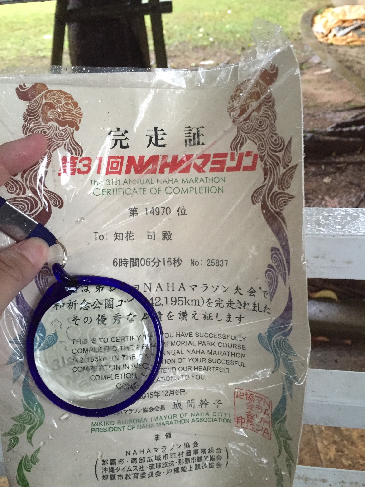

class: center, middle

# WebRTCの勉強でむりやりGo使ってみた！

---

# 自己紹介

### 知花司
### [CAAdvance沖縄](http://www.ca-adv.co.jp/) 所属
### 普段はrubyとseleniumで ~~遊んでます~~ 仕事してます

#### 沖縄県野球連盟の役員だったりもします
- [沖縄県軟式野球連盟　中部南支部　学童部　『浦添ブロック』公式ブログ](http://urasoeburokku.ti-da.net/e5979065.html)

---

### こんな体型ですが、去年那覇マラソン完走しました

---

# WebRTC?

## Web Real Time Communication の頭文字
## ブラウザ間でUDP上使ってp2p通信する仕組み
## 接続確立するまえにお互いの紹介所(シグナリングサーバー)が必要

---

# Goでやったこと

# socket.io

# 以上!

---

# Goで実装するにあたり

## direnv使いましょう

### goは環境変数$GOPATHに依存関係の追加パッケージ等なんでもぶち込んでくれます。 もともとビルド処理のために開発された言語なので単体で動くように設計されていて、ビルド設定ファイルとかは使用しない設計らしい。
### この挙動は複数プロジェクト開発するとき不安になるのでdirenvでプロジェクトごとに切り替えました。

---

# ハマったこと

## goのchannelの送受信は半非同期。
## 便利だけどデッドロックに注意が必要
## チャネル作成と同時にハンドラー実行する癖つければ問題ないので慣れの問題かなと

---

# 詳細はQiitaに書いたのでお時間ある方はどうぞ

http://qiita.com/hogehoge-banana/items/2a3c15b8f68de951bfe3
